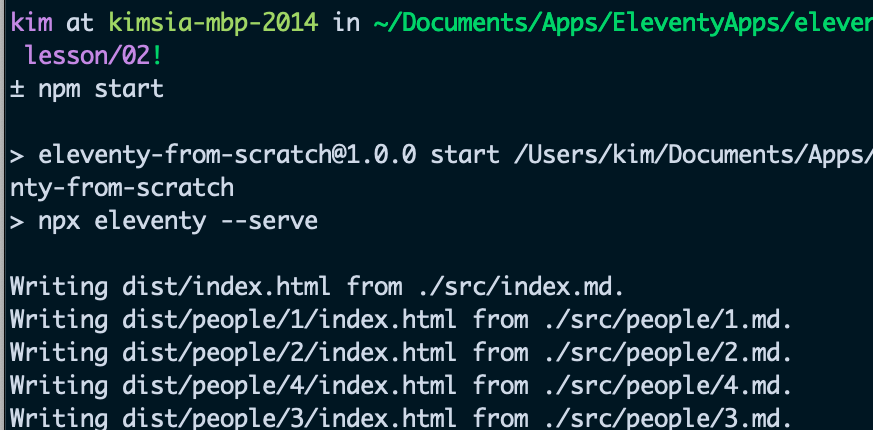

# Learn "Learn Eleventy from Scratch"

The [course](https://piccalil.li/course/learn-eleventy-from-scratch/?campaign=YB0HOENA)

## Lessons

    1. [Lesson 01](https://github.com/simkimsia/learn-learn-eleventy-from-scratch/tree/lesson/01)
    2. [Lesson 02](https://github.com/simkimsia/learn-learn-eleventy-from-scratch/tree/lesson/02)
    3. [Lesson 03](https://github.com/simkimsia/learn-learn-eleventy-from-scratch/tree/lesson/03)
    4. [Lesson 04](https://github.com/simkimsia/learn-learn-eleventy-from-scratch/tree/lesson/04)
    5. [Lesson 05](https://github.com/simkimsia/learn-learn-eleventy-from-scratch/tree/lesson/05)
    6. [Lesson 06]()
    7. [Lesson 07]()
    8. [Lesson 08]()
    9. [Lesson 09]()
    10. [Lesson 10]()
    11. [Lesson 11]()
    12. [Lesson 12]()

## Minimum Unambiguous Sign of Change (MUSoC)

How to know that the lesson was done correctly

### Lesson 01

### Lesson 02

