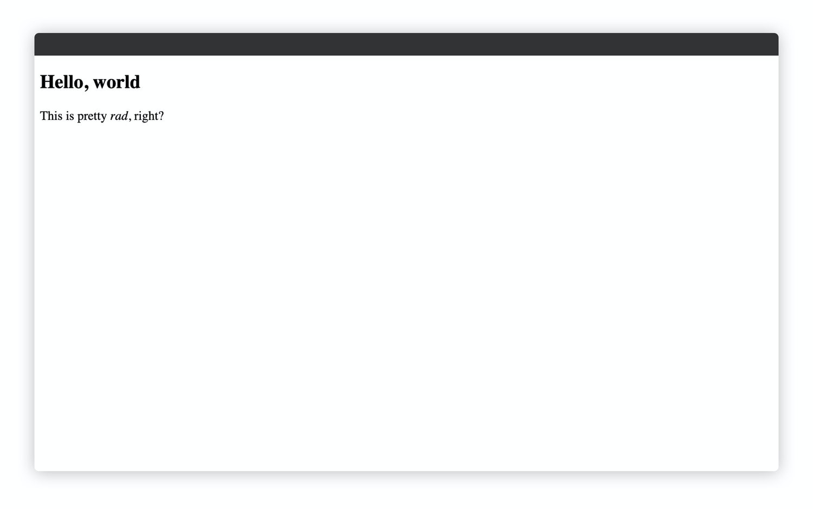

# Learn "Learn Eleventy from Scratch"

The [course](https://piccalil.li/course/learn-eleventy-from-scratch/?campaign=YB0HOENA)

Note: this is a public repo that only covers the free 5 lessons of the course. I have a private repo that contains all my steps up to lesson 13 (as of 2020-10-18 14:44 +8) because I checked with the course creator Andy Bell. And he prefers I put the other commits behind private repo.

I think I will leave the commits for the public lessons here in public repo as well for now.

## Lessons

1. [Lesson 01](https://github.com/simkimsia/learn-learn-eleventy-from-scratch/tree/lesson/01)
2. [Lesson 02](https://github.com/simkimsia/learn-learn-eleventy-from-scratch/tree/lesson/02)
3. [Lesson 03](https://github.com/simkimsia/learn-learn-eleventy-from-scratch/tree/lesson/03)
4. [Lesson 04](https://github.com/simkimsia/learn-learn-eleventy-from-scratch/tree/lesson/04)
5. [Lesson 05](https://github.com/simkimsia/learn-learn-eleventy-from-scratch/tree/lesson/05)

## Minimum Unambiguous Sign of Change (MUSoC)

How to know that the lesson was done correctly

### Lesson 01

Original lesson content: https://piccalil.li/course/learn-eleventy-from-scratch/lesson/1/

### Lesson 02

Original lesson content: https://piccalil.li/course/learn-eleventy-from-scratch/lesson/2/

### Lesson 03

Original lesson content: https://piccalil.li/course/learn-eleventy-from-scratch/lesson/3/

### Lesson 04

Original lesson content: https://piccalil.li/course/learn-eleventy-from-scratch/lesson/4/

### Lesson 05

Original lesson content: https://piccalil.li/course/learn-eleventy-from-scratch/lesson/5/

